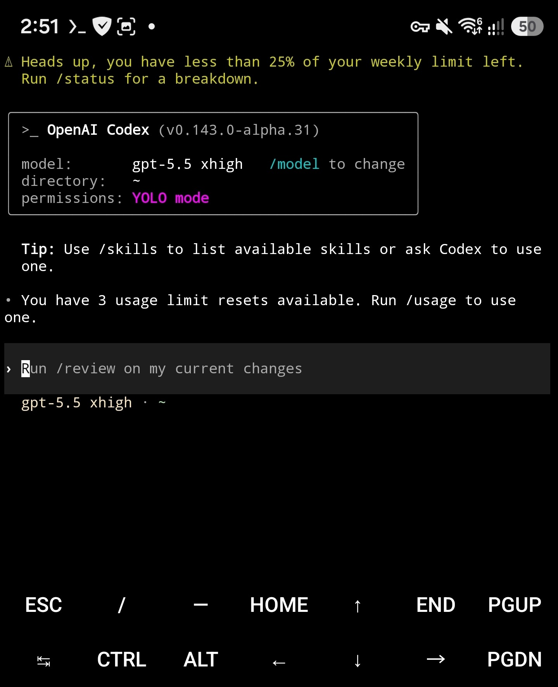

# Codex Termux Pocket

Codex CLI for aarch64 Android phones running current Termux. For desktop
platforms, use [OpenAI Codex](https://github.com/openai/codex).

<p align="center">
  
</p>

## Install

Install Termux from F-Droid or the Termux GitHub releases, then paste:

```shell
pkg update -y && pkg install -y curl && curl -fsSL https://raw.githubusercontent.com/Kbediako/codex-termux-pocket/5797ea1be011cdf43cb897814835b421decf9f54/scripts/termux/install-codex-termux | bash
```

The bootstrap URL is commit-pinned. The installed helper checkout still tracks
this fork's protected `main` branch for verified updates, but a later change to
`main` cannot silently replace the installer that this command downloads.

Then run `codex login` and choose the browser flow. The installer is idempotent,
installs the complete verified runtime, and never rebases source on the phone.

## Update and recovery

```shell
codex-update-alpha update
codex-update-alpha check
codex-update-alpha wait --run-id RUN_ID --expected-sha COMMIT_SHA
codex-update-alpha install-run --run-id RUN_ID --expected-sha COMMIT_SHA
smoke-test-artifact --installed
```

See the [update and recovery guide](./docs/termux-mobile-update.md) or the
[maintainer guide](./docs/termux-maintainer.md). Contributions follow the
[contributing guide](./docs/contributing.md).

This repository is licensed under the [Apache-2.0 License](LICENSE).
