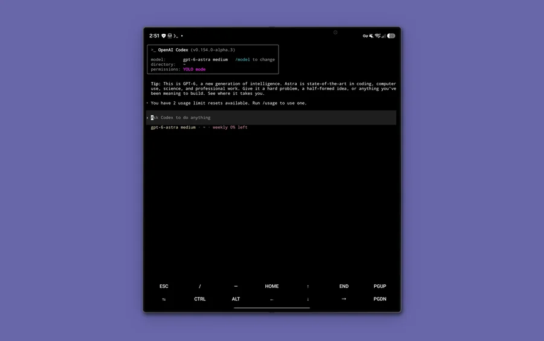

# Codex Termux Pocket

Codex CLI for aarch64 Android phones running current Termux. For desktop
platforms, use [OpenAI Codex](https://github.com/openai/codex).

<!-- README artwork: follow .github/assets/AGENTS.md and .github/assets/readme/README.md. -->
<p align="center">
  
</p>

## Install

Install Termux from F-Droid or the tested [Termux GitHub](https://github.com/termux/termux-app/releases/tag/v0.118.3) v0.118.3 release, then paste:

```shell
pkg update -y && pkg install -y curl && curl -fsSL https://raw.githubusercontent.com/Kbediako/codex-termux-pocket/8fe2fc1bc20828208b3a097d15572e5d1c78b201/scripts/termux/install-codex-termux | bash
```

Then run `codex login` and choose the browser flow. The installer is idempotent,
installs the complete verified runtime, and never rebases source on the phone.

## Update and recovery

```shell
codex-update-alpha update
codex-update-alpha check
codex-update-alpha wait --run-id RUN_ID --expected-sha COMMIT_SHA
codex-update-alpha install-run --run-id RUN_ID --expected-sha COMMIT_SHA
smoke-test-artifact --installed
```

See the [update and recovery guide](./docs/termux-mobile-update.md) or the
[maintainer guide](./docs/termux-maintainer.md). Contributions follow the
[contributing guide](./docs/contributing.md).

This repository is licensed under the [Apache-2.0 License](LICENSE).
